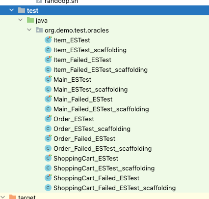

# Shopping (Demo project - Test Oracles Generation)

This project is a demo project to show the benefits of automatically generating test oracles with, for a given Java project.

## Project description
The project contains a simple program that simulates the generation of an invoice for a shopping cart. 
The project is composed of the following classes:

- `ShoppingCart`: Represents a shopping cart that contains a list of items.
- `Item`: Represents an item that can be added to the shopping cart. Each item has an identifier, a name, a price, and a quantity.
- `Order`: Represents an order that contains the list of items in the shopping cart and the total price of the items.
- `Main`: Initializes and runs the program.

The program receives as input:

- A list of items to be added to the shopping cart (for each item you have to provide the quantity). Moreover, the same items can be added to the shopping cart multiple times (the quantity will be aggregated). The identifier of the item is used to identify the product and merge the multiple occurrences.
- The discount percentage to apply to some items in the cart.
- The number of items to be discounted (the discount will be applied to the first items in the cart).

Given the list of items, the program generates a corresponding shopping cart.
Then the program generates an order from the shopping cart, sorting the items by price (descendent order).
After that, the program applies the discount to the first items in the order. The number of items to be discounted takes 
into account the quantity of the items in the cart. For example, if the cart contains 3 items of type A, 2 items of type B, 
and 1 item of type C, and the discount is applied to the first 4 items, the discount will be applied to 3 items of type A 
and 1 item of type B.
Finally, the program calculate the total price of the order.

The program has been injected with several bugs that affect the correct generation of the order, and the calculation of 
the discounts and the final price.

## 1. Manually generate test oracles

Before to understand how to automatically generate test oracles and see the pros and cons of automatically generating test
oracles, try to manually generate test cases with test oracles to check if the correctness of the code.

**N.B.: The code contains several bugs that affect the correct generation of the order, and the calculation of the discounts**

## 2. Automatic test cases and test oracles generation

### 2.1 Initialize project dependencies

Install a local version of [SdkMan](https://sdkman.io/) (a Java SDK manager), executing the `init.sh` script.
SdkMan will be installed within the path: `src/main/resources/sdkman`. Moreover, the script will download the jars of
the project, evosuite (used to automatically generate test suites), Jdoctor (a tool to generate axiomatic oracles), and 
oracles-to-test (a tool to insert oracles within test prefixes). To download the resources, the `wget` library is required.
Check if the library is installed on your machine, otherwise install it checking the proper command [here](https://command-not-found.com/wget).

```bash 
$ bash src/main/scripts/init.sh
```

## 2.2 Generate tests with Evosuite
To automatically generate test oracles for each class of the project, execute the `generate_evosuite_tests.sh` script.

```bash
$ bash src/main/scripts/generate_evosuite_tests.sh
```

The script will generate test cases for each class of the project and save them in the `output/evosuite-tests` directory.
Moreover, the script will generate a version of the same test cases without assertions (only test prefix). The test prefixes
will be saved in the `output/evosuite-tests-prefix` directory.

## 2.3 Execute the tests with Evosuite
TO execute the test cases generated with Evosuite, move the generated test classes within the folder `src/test`.



Then, execute the tests from the IDE or the command line and see how many tests fail.

## 2.4 Generate axiomatic oracles with Jdoctor

To automatically generate axiomatic oracles for each class of the project, execute the `jdoctor.sh` script.

```bash
$ bash src/main/scripts/jdoctor.sh
```

The script will generate axiomatic oracles for each class of the project and save them in the `output/jdoctor-oracles` directory.
Moreover, the script will generate test cases, adding the oracles within the test prefixes generated with evosuite.

## 2.5 Execute the tests with axiomatic oracles

To execute the test cases with the axiomatic oracles, move the generated test classes within the folder `src/test` and 
launch the tests from the IDE or the command line. Did you notice any difference in the number of failing tests?

## 3. Questions

1. What are the advantages and disadvantages of manually generating test oracles?
2. What are the advantages and disadvantages of automatically generating test oracles?
3. What are the differences between the test cases generated with Evosuite and the test cases generated with Jdoctor?
4. Does the use of axiomatic oracles improve the quality of the test cases?
5. Are the automatically generated test cases sufficient to detect all the bugs in the code?